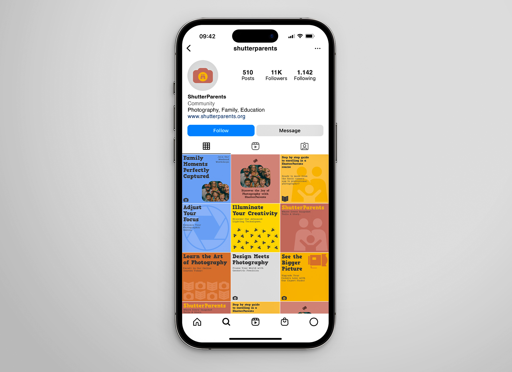

# Social Media

### Instagram profile page

<figure><figcaption>
ShutterParents Instagram page mockup
</figcaption></figure>

#### Instagram Portrait banners (1080 x 1080 pixels)

<figure><figcaption></figcaption></figure>

<figure><figcaption></figcaption></figure>

<figure><figcaption></figcaption></figure>

<figure><figcaption></figcaption></figure>

<figure><figcaption></figcaption></figure>

<figure><figcaption></figcaption></figure>

<figure><figcaption></figcaption></figure>

<figure><figcaption></figcaption></figure>
