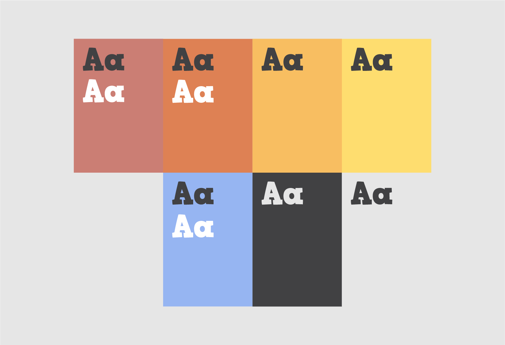
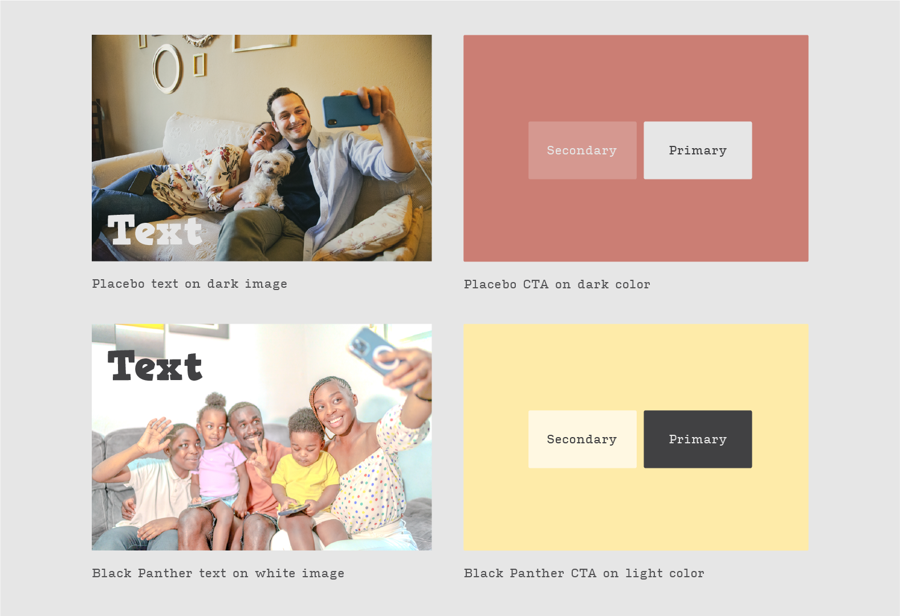

# Accessibility

Some color combinations are particularly hard to read, even more so for people who are visually impaired or colorblind. Below are suggestions on color usage for the web that accommodate accessibility and legibility.

<figure><figcaption>
Recommended text-color sitting on colored background
</figcaption></figure>

<figure><figcaption></figcaption></figure>
