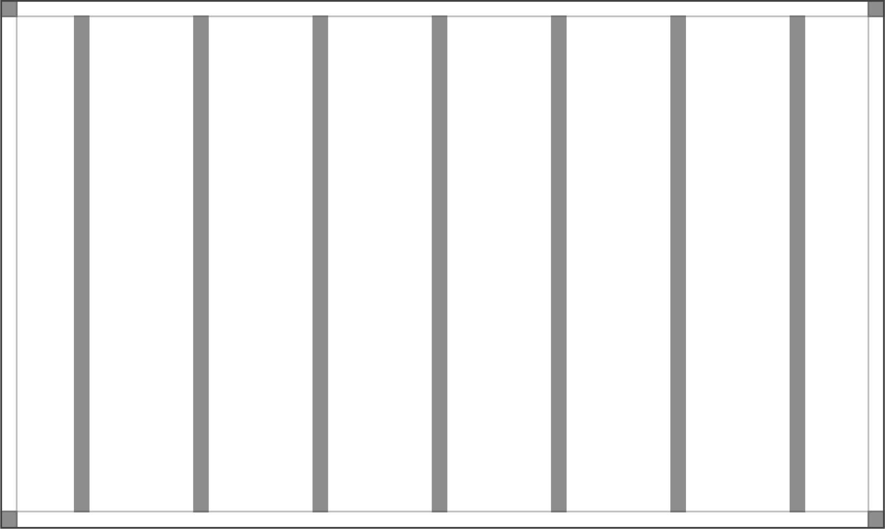

# Columns

Here are the most common number of columns used in vertical and horizontal formats. In order to determine the width of column gutters, we divide the margin width in half.&#x20;

For example, if the margin in a composition is 5% of the total width, the gutters will be 2.5% of the total width.

### Column vertical layout

<figure><figcaption>
7 column vertical layout with 5% margin and 2.5% gutter
</figcaption></figure>

### Column square layout

<figure><figcaption>
7 column square layout with 5% margin and 2.5% gutter
</figcaption></figure>

### Column horizontal layout

<figure><figcaption>
8 column horizontal layout with 5% margin and 2.5% gutter
</figcaption></figure>
