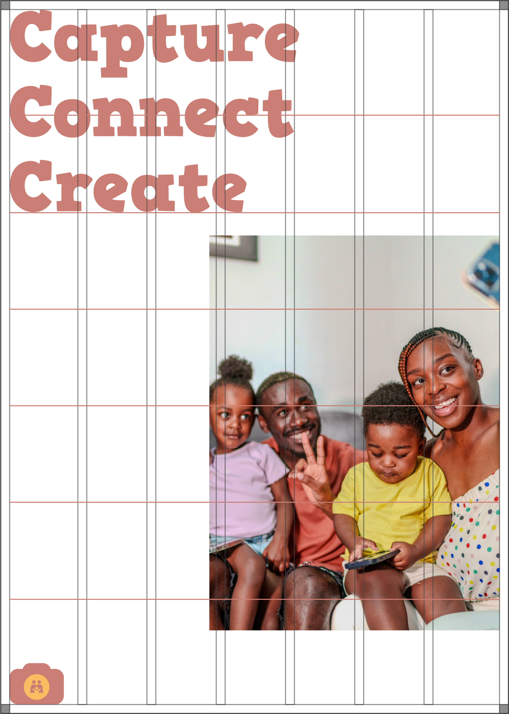

# Content Layout

### Content vertical layout

<figure><figcaption>
Content (copy, photo, and ShutterParents' logomark) placed on 7 column vertical layout with 5% margin, 2.5% gutter and 6 hang-lines
</figcaption></figure>

### Content square layout

<figure><figcaption>
Content (copy, photo, and ShutterParents' logomark) placed on 7 column square layout with 5% margin, 2.5% gutter and 4 hang-lines
</figcaption></figure>

### Content horizontal layout

<figure><figcaption>
Content (copy and photo) placed on 8 column vertical layout with 5% margin, 2.5% gutter and 2 hang-lines
</figcaption></figure>
