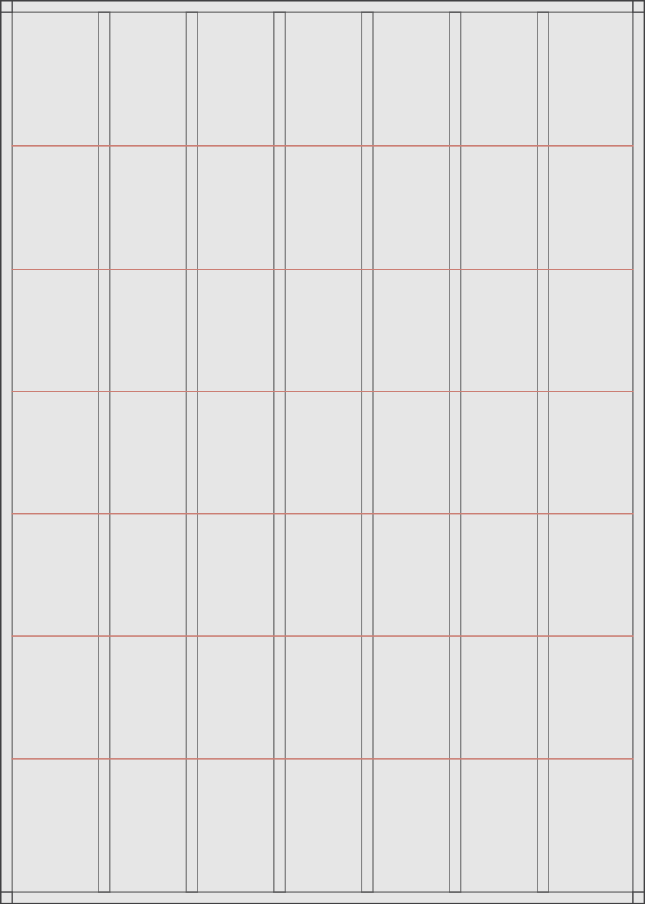
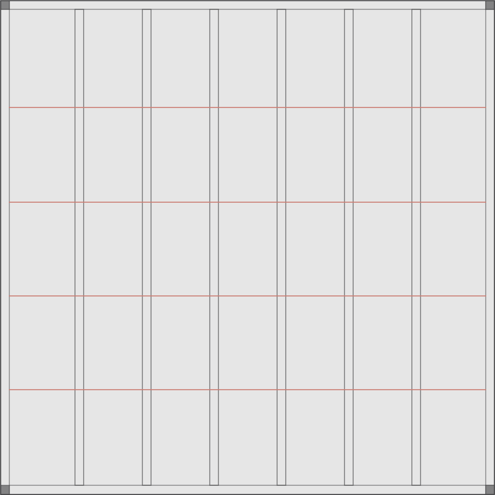
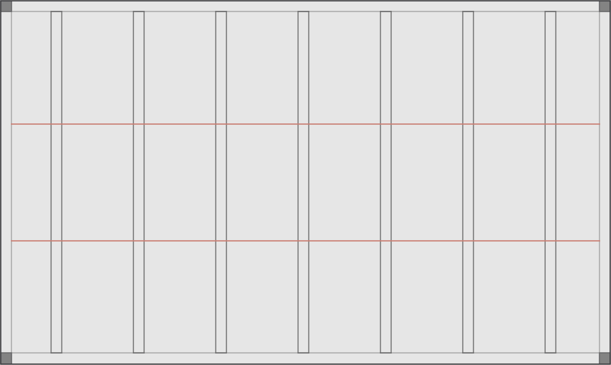

# Hang lines

Our hang lines can also inform the placement and scale of our graphic system.

### Hang lines vertical layout

<figure><figcaption>
7 column vertical layout with 5% margin, 2.5% gutter and 6 hang lines
</figcaption></figure>

### Hang lines square layout

<figure><figcaption>
7 column square layout with 5% margin, 2.5% gutter and 4 hang lines
</figcaption></figure>

### Hang lines horizontal layout

<figure><figcaption>
8 column horizontal layout with 5% margin, 2.5% gutter and 2 hang lines
</figcaption></figure>
