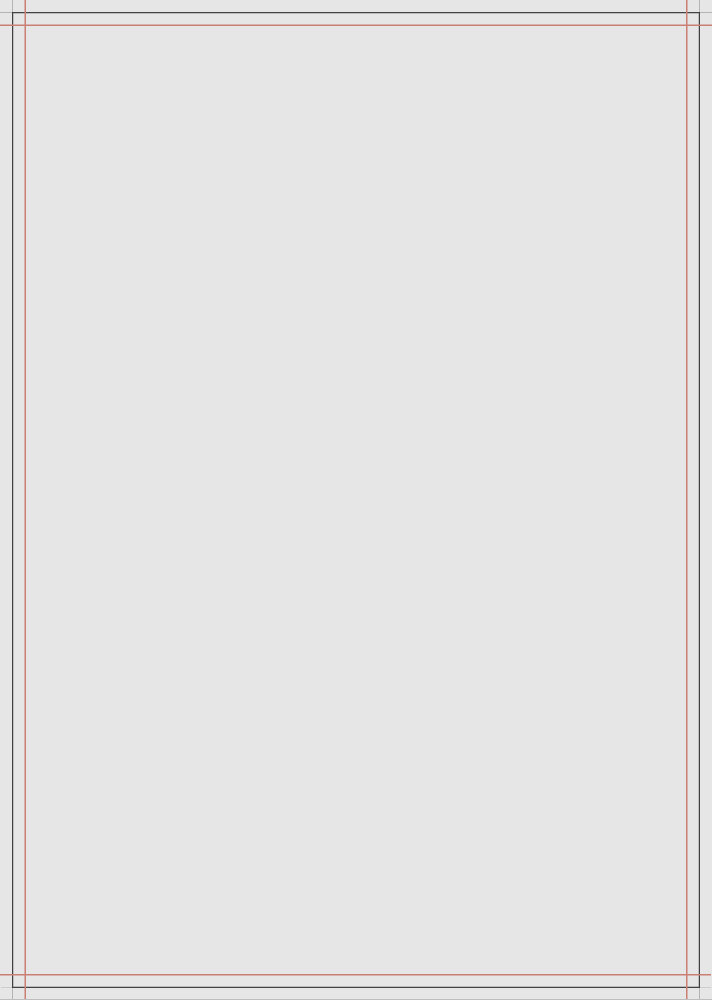
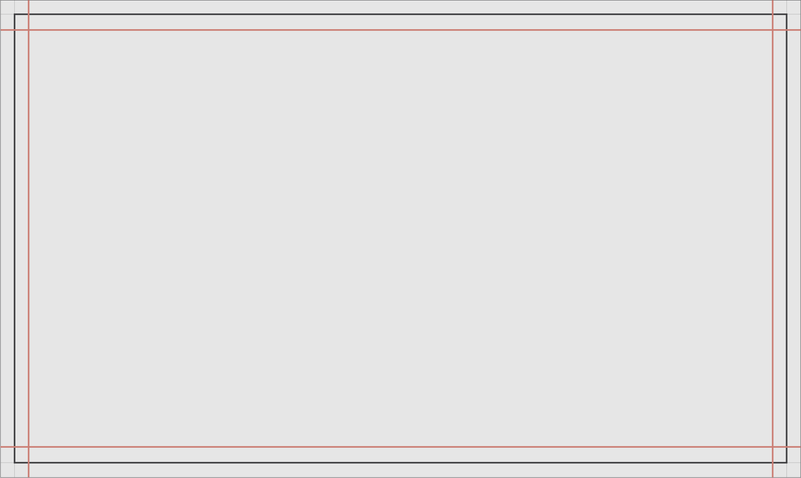

# Margins

### Margin vertical layout

<figure><figcaption>
Black margin is 5% while brown color is 10% margin
</figcaption></figure>

### Margin square layout

<figure><figcaption>
Black margin is 5% while brown color is 10% margin
</figcaption></figure>

### Margin horizontal layout

<figure><figcaption>
Black margin is 5% while brown color is 10% margin
</figcaption></figure>
