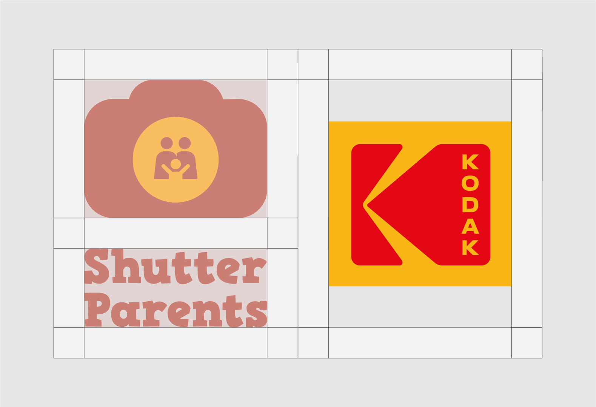

# Partnership

<figure><figcaption>
Brand partnership clear space
</figcaption></figure>

_<mark style="background-color:yellow;">\*Kodak is just to show dual logo placement, Kodak have nothing to do with ShutterParent’s brand.</mark>_&#x20;
