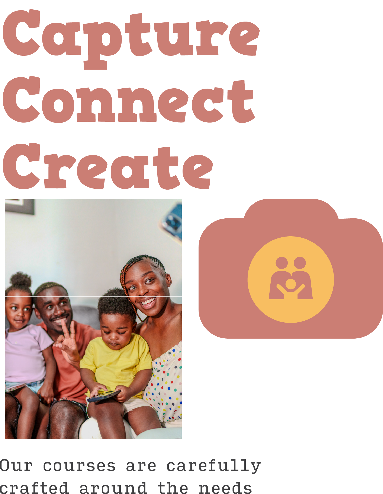
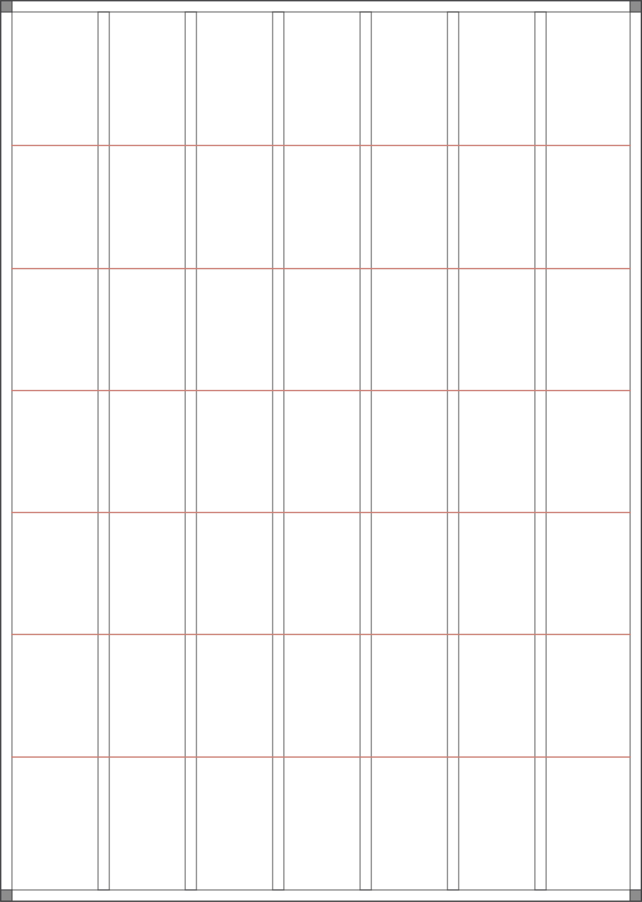
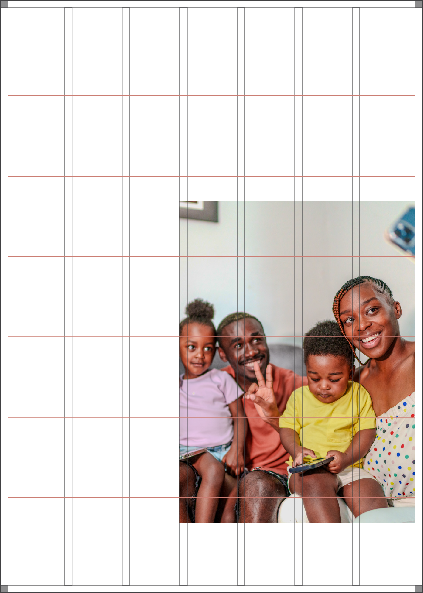
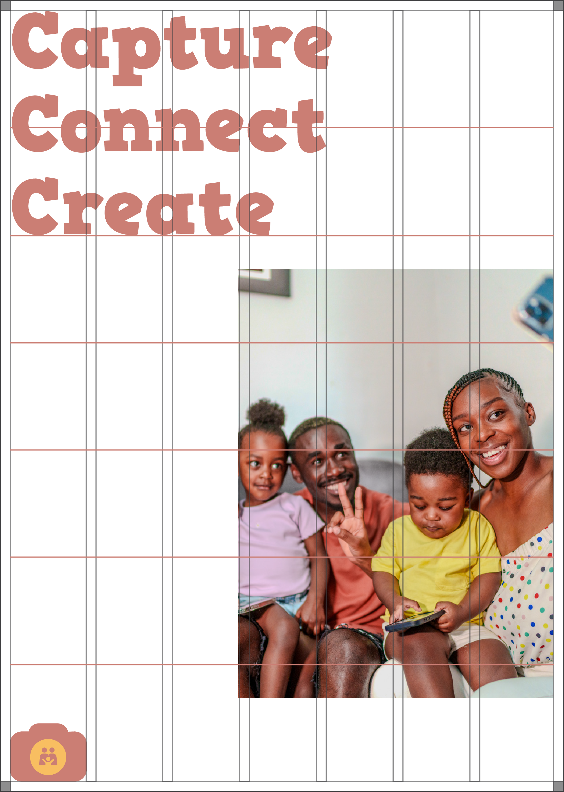
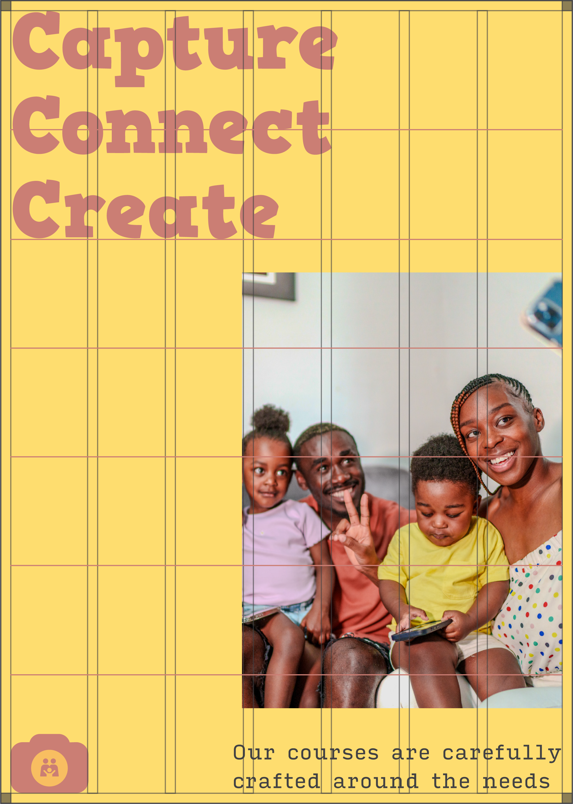

# Process Summary

### Assets

Gather your content together before designing and creating layout. Example of contents are:

* Headline content
* Photo
* Logomark
* Body content

<figure><figcaption></figcaption></figure>

### Establish layout format

Decide whether you are designing for vertical, square or horizontal, depending on the digital screen your will be publishing. For this exercise, we use vertical.

* Margins
* Columns
* Hang lines

<figure><figcaption>
7 column vertical layout with 5% margin, 2.5% gutter and 6 hang-lines
</figcaption></figure>

### Add photo

Place photo inside margin, column and hang line.

<figure><figcaption>
Photo placed inside 7 column vertical layout with 5% margin, 2.5% gutter and 6 hang-lines
</figcaption></figure>

### Add logo and copy

<figure><figcaption>
Content placed inside 7 column vertical layout with 5% margin, 2.5% gutter and 6 hang-lines
</figcaption></figure>

### Add background color

Add color and body content

<figure><figcaption></figcaption></figure>
