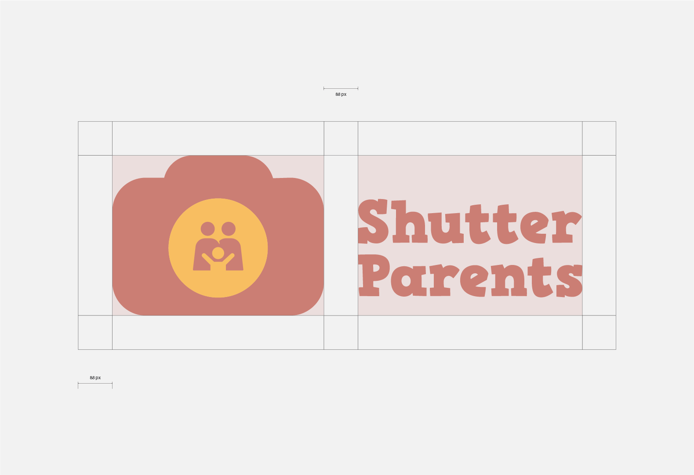
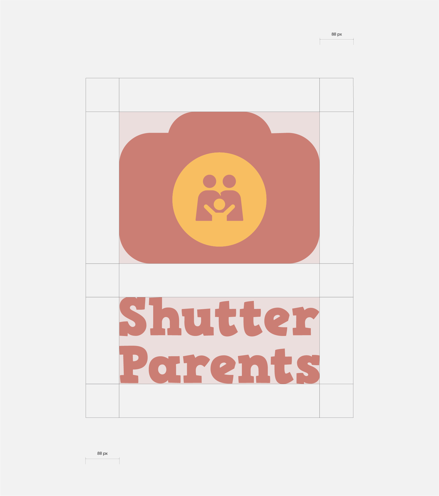

# Clear Space

This zone should be considered as the absolute minimum safe distance (88px). In most cases, the logo should be given even more room to breathe.

<figure><figcaption>
Clear space horizontal logo
</figcaption></figure>

<figure><figcaption>
Clear space vertical
</figcaption></figure>
