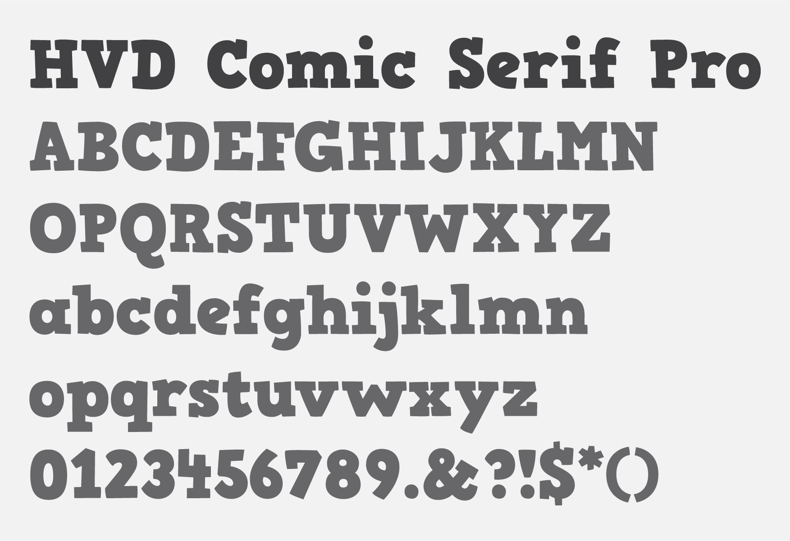

---
layout:
  title:
    visible: true
  description:
    visible: false
  tableOfContents:
    visible: true
  outline:
    visible: true
  pagination:
    visible: true
---

# Primary Typeface

HVD Comic Serif Pro is selected as the primary font for the ShutterParents brand. This font combines a playful and friendly spirit with a hint of elegance, ensuring the brand image reflects both creativity and professionalism.

### HVD Comic Serif Pro

<figure><figcaption></figcaption></figure>

Font: HVD Comic Serif Pro\
Weight: Normal\
Source: Adobe Font

**Primarily used for:**

* Headings
* Subheadings
* Call-to-action
* Key statements
* Highlights
