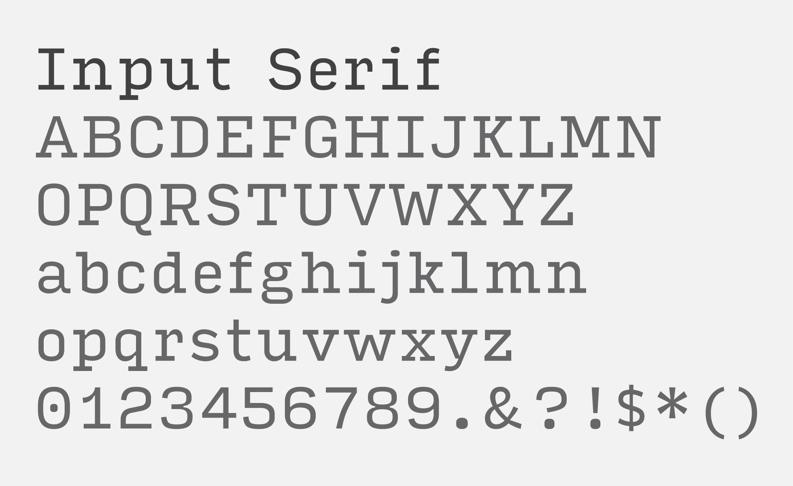

---
layout:
  title:
    visible: true
  description:
    visible: false
  tableOfContents:
    visible: true
  outline:
    visible: true
  pagination:
    visible: true
---

# Secondary Typeface

Input Serif, a flexible and highly legible typeface, is the secondary font for ShutterParents. This font complements HVD Comic Serif Pro by providing contrast and balance, while also maintaining the brand’s friendly and professional image.

### Input Serif

<figure><figcaption></figcaption></figure>

Font: Input Serif\
Weight: Regular\
Source: Adobe Font

**Primarily used for:**

* Paragraph text
* Descriptions
* Captions
* Technical information
